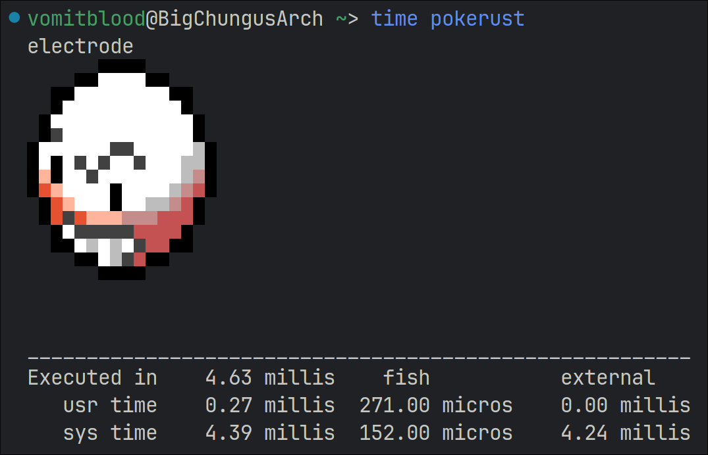

# PokeRust

*For educational purposes*  
A simple colorscript written in Rust.

Inspired by [phoneybadger's pokemon-coloscripts](https://gitlab.com/phoneybadger/pokemon-colorscripts).

## Performance

This is written in Rust, while the original is written in Python.  
This implementation is up to 8 times faster than the original.  

This is the Python implementation:

This is the Rust implementation:

## Credits

- [phoneybadger](https://gitlab.com/phoneybadger) for the original colorscripts and inspiration.
- [talwat](https://github.com/talwat/pokeget-rs) for Rust code reference. (fast af implementation at ~1ms)
- [msikma](https://github.com/msikma/pokesprite/) for the colorscripts' sprites.
