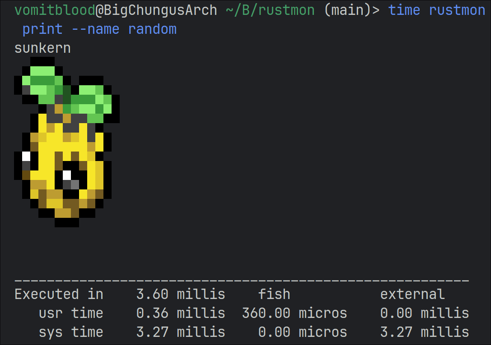
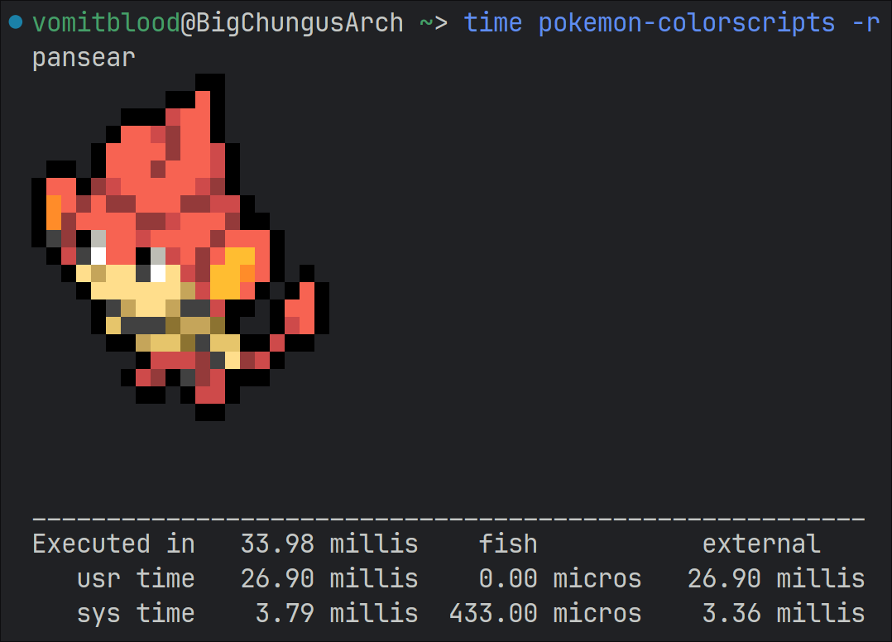

# Rustmon

A feature-rich, versatile colorscript printer written in Rust.

Inspired by [phoneybadger's pokemon-colorscripts](https://gitlab.com/phoneybadger/pokemon-colorscripts).

## Performance

This is written in Rust, while the original is written in Python.  
This implementation is up to 10 times faster than the original.  
(Sixteen times the detail)  

This is the Rust implementation:

This is the Python implementation:

## Features

## Printing

- Print a colorscript of a Pokemon.
- Print a chungus colorscript of a Pokemon.
- Specify your custom shiny rate.
- Specify the colorscript by Pokemon name.
- Specify the colorscript by Pokedex ID.
- Print multiple colorscripts at once in a row.
- Print different colorscript forms of a Pokemon.

## Fetching

- Fetch the colorscript of a Pokemon from the internet.
- Extract to a custom location for your own use.

## Say

- Pokemonsay, inspired by cowsay. Pipe text into it or use `--text` to make a Pokemon say it.

## Credits

- [phoneybadger](https://gitlab.com/phoneybadger) for the original colorscripts and inspiration.
- [talwat](https://github.com/talwat/pokeget-rs) for Rust code reference. (fast af implementation at ~1ms)
- [msikma](https://github.com/msikma/pokesprite/) for the colorscripts' sprites.
